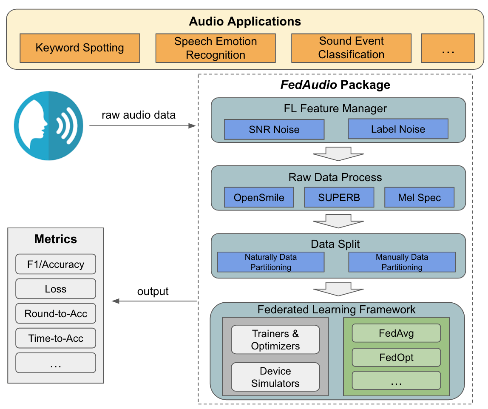

# FedAudio: A Federated Learning Benchmark for Audio Tasks

## Table of Contents
* Overview
* Installation
* Supported Dataset
* Usage
* Contact

## Overview
Federated Learning has gained considerable interest in enabling multiple clients holding sensitive data to collaboratively train machine learning models without centralizing data. However, while many works have addressed the application of audio tasks with FL, few realistic FL datasets exist as benchmarks for algorithmic research. 
Therefore, we present FedAudio, a benchmark guideline suite for evaluating federated learning methods on audio tasks. 


The FedAudio package contains:
* Data loaders with various types of data preprocessing methods and automatically partitioning.
* FL feature managers to inject noise on top of the raw signal to simulate the realstic FL challenges.
* Baseline evaluation results and code with popular aggregation functions.

<div align="center">
 
</div>

## Installation
In our repo, we include an unoffical offline version of FedML as an example to implement the FedAudio. Users could directly clone our repo and run the code without installing any other federated learning frameworks.

**This work, FedAudio, is independent to the FedML Inc.**

To begin with, please clone this repo and install the conda environment:
```
git clone https://github.com/zhang-tuo-pdf/FedAudio.git
cd FedSpeech22
conda env create -f fedspeech.yml
conda activate fedml
```
To make sure the fully functioning for the data downloading and processing, please install the below packages as well:
```
apt install sox
brew install git-lfs
```

## Supported Dataset
Currently, FedAudio encompasses four audio datasets (Google Speech Command, IEMOCAP, CREMA-D, Urban Sound) with client partition, covering three common tasks, and accompanied by baseline training code and results. We would continue enriching the package with datasets and baseline from other applications to support more research scenarios. Please leave an message to us if you want to contribute or have some suggestions for the package development.

### Data Downloading
For most of the dataset, user could directly download by the given bash file. Take the Google Speech Command as instance:
```
cd data/speech_commands
bash download_audio.sh
```
For IEMOCAP dataset, please follow its offical website for the access.

https://sail.usc.edu/iemocap/iemocap_release.htm

### Data Loading Framework
In the FedAudio package, all the dataset loading would follow the below procedure:

raw data -> data split -> adding fl feature (optional) -> preprocess -> torch dataloader

The output from the data split phase would look like this: [key, wav_command, word_id]. 

For example: ['004ae714_nohash_1_zero', '../data/speech_commands/audio/zero/004ae714_nohash_1.wav',  34]

### Data Preprocess
In the prepossessing data phase, FedAudio is compatible with OpenSMILE toolkit, SUPERB toolkit, and frequency-based feature extracting techniques such as mfcc and Mel Spectrograms. With the modular design, user could freely select the desired way for the feature extraction in the loader file. For example, for the Google Command dataset, the code for the preprocessing is below:

```
cd data_loading/data_loader
taskset 100 python gcommand_loader.py
```

Inside the gcommand_loader.py, user could change the variables such as 'process_method' to match customized needs. The loader file would generate a bin file to storage the processed data, so the user do not need to run the loader file everytime before running FL experiments.

### FL Feature Manager

Currenly, we support two different kinds of noisy, SNR noisy and label noisy.

#### SNR noise
To work with the SNR noise, please follow the steps below:
1. In the loader.py file for each dataset (inside data_loading/data_loader), make the **"fl_feature"** to true and set the desired the noisy level in **"db_level"**.
2. In the main file (experiment/distributed_main.py), set the **'fl_feature'** to true and **'db_level'** to the same number in the data loading phase.

#### Label noise
To work with the noisy noise, please follow the steps below:
1. In the main file (experiment/distributed_main.py), set the **'label_nosiy'** to true and **'label_nosiy_level'** to the desired noisy level number. We do not need to reproduce the processed data bin file for the label noisy signals.

## Usage
step 0: download the dataset
```
cd data/speech_commands
bash download_audio.sh
```

step 1: load the dataset
```
cd data_loading/data_loader
python gcommand_loader.py
```
step 2: run the fl training
```
cd experiment
sh run_distributed.sh gcommand 2118 10 8 30 1 16 0.1 0 8
# dataset name, total client number, sampled client number, gpu number, round number, local epoch number, batch size, lr, start gpu, total gpu
```

## Contact
Feel free to contact us!

Tuo Zhang tuozhang@usc.edu

Tiantian Feng tiantiaf@usc.edu 

Special Thanks to Samiul Alam!


